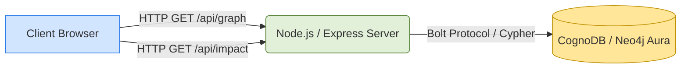
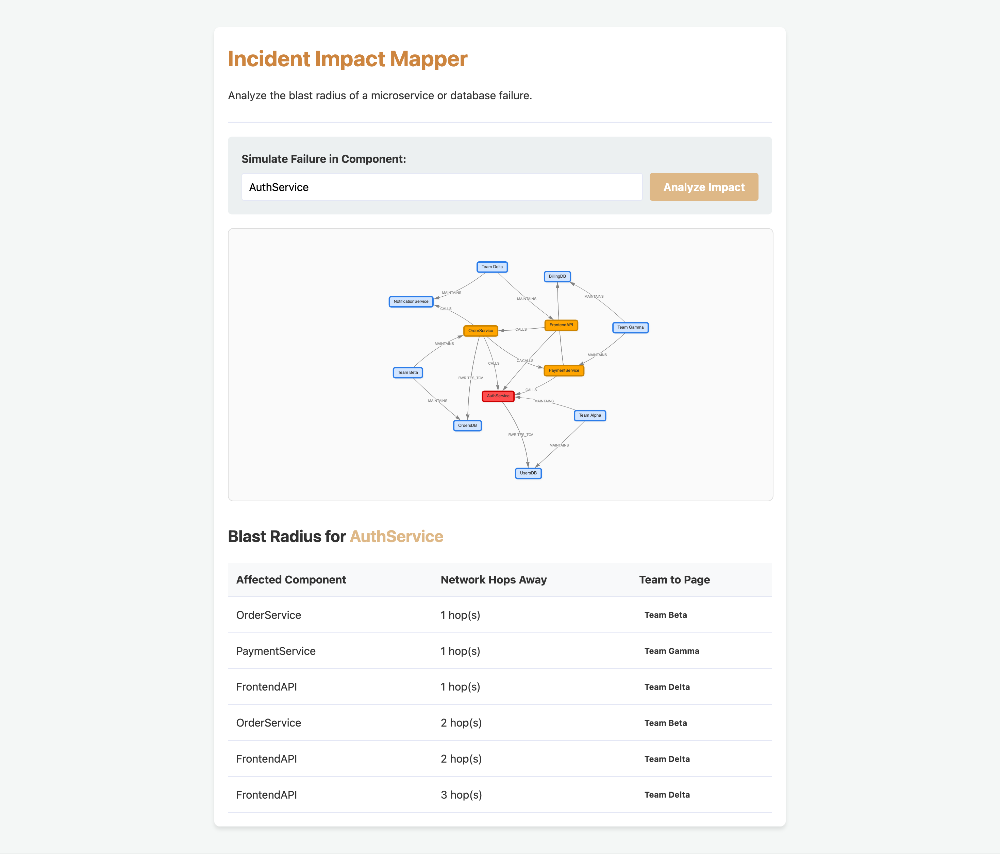

# Microservice Incident Impact Mapper

**Live Demo:** [https://incident-impact-mapper.onrender.com](https://incident-impact-mapper.onrender.com)

This is a Graph Database application built for the Wexa AI Take-Home Assignment.

## 1. Why a Graph Database?
Modern microservice architectures are deeply connected. Services call other services, and services read from/write to databases. When an incident occurs (e.g., `UsersDB` goes down), engineering teams need to know exactly which downstream services and user-facing features will be impacted so they can page the right teams.

**Relational SQL vs Graph:**
In a relational database, mapping this out would require highly complex, recursive SQL `JOIN` statements that become exponentially slower with each degree of separation (e.g., Service A -> Service B -> Service C -> Database D). 
In a graph database, this is simply a path-finding problem. Graph databases treat relationships as first-class citizens, making multi-hop impact analysis instantaneous and the queries highly readable.

## 2. Graph Data Model
The model consists of 3 Node Labels and 3 Relationship Types:

### Nodes:
- `(Service)`: A microservice (e.g., AuthService)
- `(Database)`: A datastore (e.g., UsersDB)
- `(Team)`: An engineering team (e.g., Team Alpha)

### Relationships:
- `(Service)-[:CALLS]->(Service)`
- `(Service)-[:READS_FROM | :WRITES_TO]->(Database)`
- `(Team)-[:MAINTAINS]->(Service | Database)`


## 3. Setup and Run Instructions

### Set up CognoDB
1. Create a free account at [console.cognodb.com](https://console.cognodb.com/signup).
2. Create a free (c0) instance.
3. Save your connection URI and password.

### Run the App Locally
1. Clone this repository.
2. Run `npm install` to install dependencies.
3. Copy `.env.example` to `.env` and fill in your CognoDB credentials:
   ```
   NEO4J_URI=bolt+s://<your-instance-id>.databases.cognodb.cloud
   NEO4J_USER=cognodb
   NEO4J_PASSWORD=<your-password>
   ```
4. Seed the database by running:
   ```bash
   node seed.js
   ```
5. Start the web server:
   ```bash
   npm start
   ```
   (Alternatively, run `node server.js`)
6. Open your browser to `http://localhost:3000`.

## 4. Main Cypher Queries Explained

**The Impact Blast Radius Query (Multi-hop traversal)**
When you search for a failing service or database (like `UsersDB`), the app runs the following parameterised Cypher query:

```cypher
MATCH path = (dependent:Service)-[:CALLS|READS_FROM*]->(failing:Service|Database {name: $serviceName})
MATCH (team:Team)-[:MAINTAINS]->(dependent)
RETURN dependent.name AS affectedService, team.name AS teamToNotify, length(path) AS hops
ORDER BY hops ASC
```

**Why is this awkward in SQL?**
The `*` in `-[:CALLS|READS_FROM*]->` tells the graph database to traverse *any number of hops* (1 to infinity). SQL does not handle variable-depth recursive queries elegantly without complex Common Table Expressions (WITH RECURSIVE), which are slow and hard to maintain.


## 5. System Architecture


## 6. UI Demo
*(See the interactive visual graph in action)*

